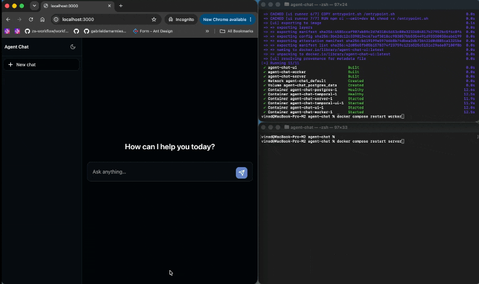

# Agent Chat

A reference app showcasing [agent-sdk-go](https://github.com/agenticenv/agent-sdk-go) — the Temporal-first AI agent SDK for Go. Built with a React UI and Go API, with durable workflow-backed conversations and real-time streaming via SSE.

> **Durable, Fault-Tolerant AI Agent Chat in Go backed by Temporal**

`agent-chat` is a reference implementation demonstrating how to build interactive, long-running agentic conversations in Go that survive container restarts, network partitions, and process crashes without losing conversation state or workflow execution context.'

> This is a reference app showcasing [agent-sdk-go](https://github.com/agenticenv/agent-sdk-go). Not intended for production use.

## Quick Demo



## Why agent-sdk-go

Most agent frameworks run in-process — if your server restarts, the agent run is lost. [agent-sdk-go](https://github.com/agenticenv/agent-sdk-go) is Temporal-first, so every agent run is a durable workflow:

- **Durable conversations** — chat history and agent runs survive server restarts
- **Long-running agents** — conversations can run for extended periods without losing state
- **Automatic retries** — failed LLM calls retry automatically via Temporal


## Stack

- **[agent-sdk-go](https://github.com/agenticenv/agent-sdk-go)** — AI agent SDK for Go
- **React Router 7 + Vite** — UI
- **Tailwind CSS v4** — Styling
- **react-markdown** + **remark-gfm** — Message bubbles render Markdown (GFM)

**Deploy shape:** Docker Compose runs the **API** (`APP_MODE=server`) and a **separate Temporal worker** (`APP_MODE=worker`) from the same server image — see **[server/README.md](server/README.md)**. Chat streaming uses **AG-UI–shaped JSON** over SSE (plus a small app extension for persisted message ids). Selecting a conversation that is still `running` reconnects via `POST /api/conversations/:id/resume` — see **[ui/README.md](ui/README.md)**.

## Prerequisites

- **Docker** — [Docker Engine](https://docs.docker.com/engine/) with **Docker Compose** (the `docker compose` CLI; Compose v2 is bundled with Docker Desktop and current Engine installs).
- **LLM access** — An API key from a supported provider (for example OpenAI or an OpenAI-compatible HTTP API). Add it to `server/.env` in the **Configuration** section below.
- **A local copy of this project** — You need the files on your computer before you can run anything (clone with Git or download a ZIP — **Get the code** below).


## How to start

Follow these steps in order. Every shell command assumes your **current directory** is the **repository root**: the folder that contains `docker-compose.yml`.

### Get the code

**Clone with Git** (recommended):

```bash
git clone https://github.com/agenticenv/agent-chat.git
cd agent-chat
```

Use your fork’s URL if you forked the repo. After `cd`, you should see `docker-compose.yml` in that directory.

**Or download a ZIP** — On GitHub, open **Code** → **Download ZIP**, unzip it, then open a terminal and `cd` into the unzipped folder (the one that contains `docker-compose.yml`).

### Configuration (Required)

Agent Chat reads `server/.env` for LLM settings. If `LLM_API_KEY` is missing, **the Agent Chat API will not start** and containers may fail or restart.

**Copy** the example file:

```bash
cp server/.env.example server/.env
```

**Required**


| Variable      | You must…                                                                         |
| ------------- | --------------------------------------------------------------------------------- |
| `LLM_API_KEY` | Set to your real LLM API key. An empty placeholder means Agent Chat cannot start. |


**Optional — LLM** (defaults are fine for OpenAI)

- `LLM_PROVIDER` — default `openai`
- `LLM_MODEL` — default `gpt-4o`
- `LLM_BASE_URL` — set only for a **custom or Azure-style** HTTP endpoint; use a `LLM_MODEL` your provider supports

**Optional — agent**

- `AGENT_SYSTEM_PROMPT` — how Agent Chat behaves (role, tone, rules). Omit to use the built-in default.
- `AGENT_NAME`, `AGENT_DESCRIPTION`, `AGENT_CONVERSATION_WINDOW_SIZE` — labeling and how much chat history is in context; see `server/.env.example`.

Full variable list and behavior: **[server/README.md](server/README.md)**.

**Copy** the UI example file (optional — only needed for local `npm run dev`, or to change defaults):

```bash
cp ui/.env.example ui/.env
```

**Optional — UI**


| Variable         | Default                                                             | Description                                                                                                      |
| ---------------- | ------------------------------------------------------------------- | ---------------------------------------------------------------------------------------------------------------- |
| `SERVER_API_URL` | `http://localhost:8080` (local) / `http://localhost:9090` (Compose) | Backend origin (no `/api`). Local: Vite proxies `/api` here. Docker: written into `config.json` for the browser. |


Full variable list and behavior: **[ui/README.md](ui/README.md)**.

### Start (Docker Compose)

Agent Chat runs with **Docker Compose** from the repository root.

**Start the stack** (Postgres, Temporal, API, UI):

```bash
docker compose up -d --build
```

**Open Agent Chat:** **[http://localhost:3000](http://localhost:3000)** — use the chat in your browser.

**(Optional) Temporal UI:** **[http://localhost:8233](http://localhost:8233)** — view Temporal workflow executions for Agent Chat.

## Try durability

Use a **long / slow prompt** (for example: ask for a detailed multi-section essay) so the agent turn stays `running` while you interrupt. Do not run `docker compose down -v` during these checks — keep Postgres and Temporal data.

### 1. Browser close / reopen

1. Send a long prompt and wait until tokens start streaming.
2. Close the browser tab (or navigate away) while the reply is still in progress.
3. Open Agent Chat again and select the **same** conversation.
4. Expect: message history loads, then the UI resumes the stream and the reply continues.


### 2. API (server) restart

1. Send a long prompt; wait until streaming has started.
2. Restart **only** the API container (leave Temporal and the worker running):

```bash
docker compose restart server
```

1. Stay on the **same** chat — do not refresh or re-select. After the API is healthy, the UI reconnects via `/resume` and tokens continue.
2. Expect: a brief pause while the server comes back, then streaming resumes on the same bubble (Temporal workflow was still running).


### 3. Worker restart

1. Send a long prompt; wait until streaming has started.
2. Restart **only** the worker:

```bash
docker compose restart worker
```

1. Leave the chat open, or reopen the same conversation if the UI disconnected.
2. Expect: Temporal reassigns work to the new worker; the turn completes (or resumes) instead of being lost.

If the model finishes before you reconnect, conversation `status` becomes `completed` and resume correctly does nothing — use a longer prompt or check Temporal UI (`:8233`) that the workflow is still running.

### Stop (Docker Compose)

```bash
docker compose down
```

